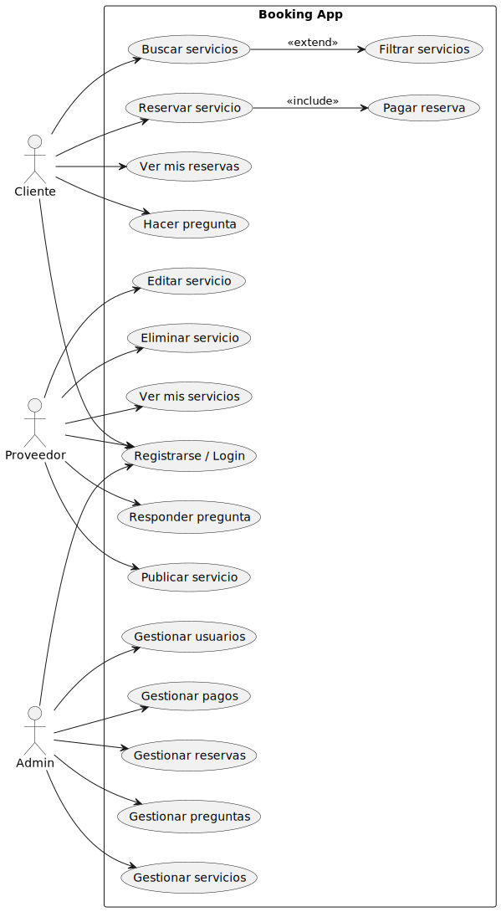
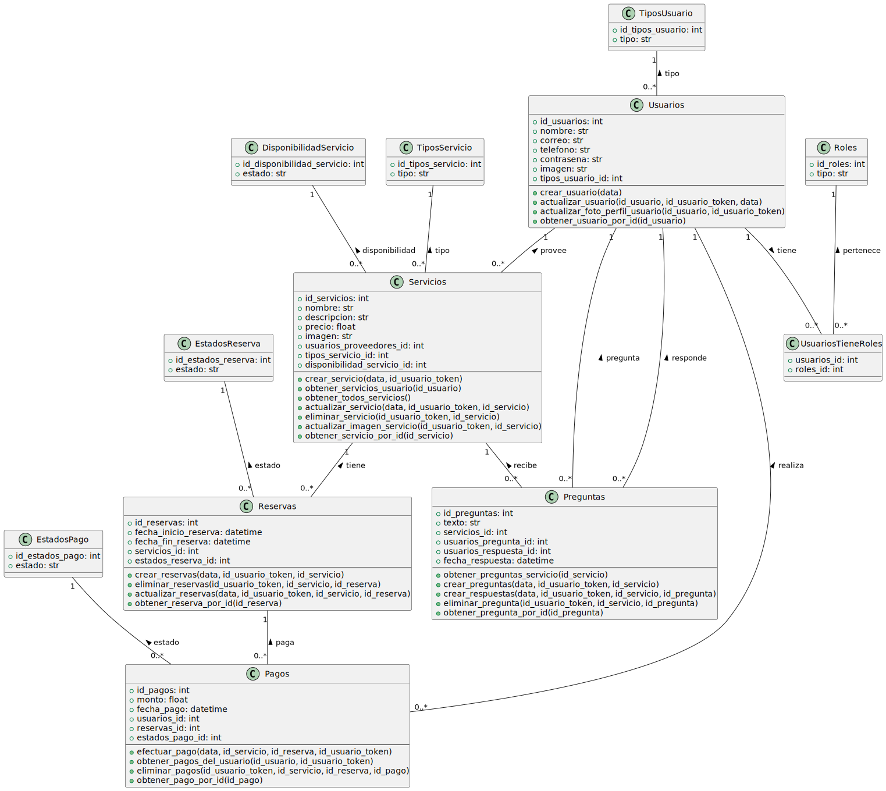

<a id="readme-top"></a>

<!-- PROJECT SHIELDS -->
[![Contributors][contributors-shield]][contributors-url]
[![Forks][forks-shield]][forks-url]
[![Stargazers][stars-shield]][stars-url]
[![Issues][issues-shield]][issues-url]
[![project_license][license-shield]][license-url]
[![LinkedIn][linkedin-shield]][linkedin-url]

<!-- PROJECT LOGO -->
<br />
<div align="center">
  <a href="#">
    
  </a>

<h3 align="center">Booking App - API de Reservas de Servicios</h3>

  <p align="center">
    <a href="#documentacion-swagger"><strong>Explora la documentación »</strong></a>
    <br />
    <br />
    <a href="#diagrama-de-casos-de-uso">Ver Diagramas</a>
    &middot;
    <a href="https://g-services.vercel.app/">Ver Demo</a>
    &middot;
    <a href="#contribucion">Contribuir</a>
  </p>
</div>

🌐 **Acceder a la aplicación:**

- API: [https://app-reservas-wg8p.onrender.com/](https://app-reservas-wg8p.onrender.com/)
- Documentación: [https://app-reservas-wg8p.onrender.com//docs](https://app-reservas-wg8p.onrender.com/docs)
- Demo: [https://g-services.vercel.app/](https://g-services.vercel.app/)
- Frontend: [https://github.com/RubDev476/General-services](https://github.com/RubDev476/General-services)

---

<details>
  <summary>Tabla de Contenidos</summary>
  <ol>
    <li><a href="#sobre-el-proyecto">Sobre el Proyecto</a></li>
    <li><a href="#arquitectura-del-proyecto">Arquitectura del Proyecto</a></li>
    <li><a href="#sistema-de-versionado">Sistema de Versionado</a></li>
    <li><a href="#como-crear-un-nuevo-versionado-de-api">Como Crear un Nuevo Versionado de API</a></li>
    <li><a href="#modulos-disponibles">Modulos Disponibles</a></li>
    <li><a href="#diagramas-del-proyecto">Diagramas del Proyecto</a></li>
    <li><a href="#tecnologias-utilizadas">Tecnologias Utilizadas</a></li>
    <li><a href="#seguridad">Seguridad</a></li>
    <li><a href="#instalacion-y-configuracion">Instalacion y Configuracion</a></li>
    <li><a href="#documentacion-de-la-api">Documentacion de la API</a></li>
    <li><a href="#testing">Testing</a></li>
    <li><a href="#contribucion">Contribucion</a></li>
    <li><a href="#contacto">Contacto</a></li>
  </ol>
</details>

---

<a id="sobre-el-proyecto"></a>
## Sobre el Proyecto

**Booking App** es una API de reservas orientada a la gestión integral de servicios de todo tipo. Permite a usuarios y proveedores interactuar en un ecosistema seguro, flexible y escalable, donde se pueden publicar, buscar, reservar y gestionar servicios de manera eficiente.

## ¿Qué permite hacer la API?
- **Publicar servicios:** Los proveedores pueden crear y administrar servicios de cualquier rubro (clases, alquileres, profesionales, actividades, etc.), incluyendo detalles, imágenes, disponibilidad y precios.
- **Buscar y filtrar servicios:** Los usuarios pueden explorar la oferta disponible aplicando filtros por tipo, precio, disponibilidad, búsqueda por nombre o descripción, etc.
- **Reservar servicios:** Los clientes pueden reservar servicios en fechas y horarios disponibles, con validaciones automáticas para evitar solapamientos o reservas en estados no permitidos.
- **Gestión de pagos:** El sistema permite registrar y validar pagos asociados a reservas, asegurando que los montos sean correctos y actualizando los estados de las reservas y servicios.
- **Preguntas y respuestas:** Los usuarios pueden realizar preguntas sobre los servicios y los proveedores pueden responderlas, facilitando la comunicación previa a la reserva.
- **Valoraciones:** (Módulo preparado) Los usuarios pueden dejar valoraciones sobre los servicios recibidos.
- **Gestión de usuarios y roles:** El sistema soporta diferentes tipos de usuarios (cliente, proveedor, admin) y roles, con autenticación JWT y login social mediante Google OAuth.
- **Panel de usuario:** Cada usuario puede gestionar su perfil, foto, datos personales y ver sus reservas, servicios o pagos.

## Características técnicas destacadas
- **API RESTful versionada:** Permite mantener y evolucionar la API sin romper compatibilidad, facilitando la migración y el mantenimiento.
- **Documentación Swagger/OpenAPI:** Todos los endpoints están exhaustivamente documentados, incluyendo ejemplos, validaciones y casos de error.
- **Validaciones robustas:** Uso de Marshmallow y validaciones personalizadas para asegurar la integridad de los datos.
- **Seguridad:** Autenticación JWT, control de roles y permisos, protección CSRF en OAuth, y manejo seguro de sesiones.
- **Arquitectura modular:** Separación clara por módulos (usuarios, servicios, reservas, pagos, preguntas, etc.) y por versiones de API.
- **Integración con servicios externos:** Subida de imágenes a Cloudinary, login con Google, etc.

<p align="right">(<a href="#readme-top">volver arriba</a>)</p>

<a id="arquitectura-del-proyecto"></a>
## 🏗️ Arquitectura del Proyecto

```
booking_app/
├── api/                          # Backend principal
│   ├── app/                      # Aplicación Flask
│   │   ├── blueprints_v1/        # Blueprint para API v1.0
│   │   ├── blueprints_v2/        # Blueprint para API v2.0
│   │   ├── swagger/              # Documentación OpenAPI/Swagger
│   │   ├── utils/                # Utilidades compartidas
│   │   ├── usuarios/             # Módulo de usuarios
│   │   │   ├── v1/               # Versión 1.0 del módulo
│   │   │   │   ├── controllers/  # Lógica de negocio v1
│   │   │   │   └── routes/       # Rutas v1
│   │   │   ├── v2/               # Versión 2.0 del módulo
│   │   │   │   ├── controllers/  # Lógica de negocio v2
│   │   │   │   ├── routes/       # Rutas v2
│   │   │   │   └── swagger/      # Documentación v2
│   │   │   ├── models/           # Modelos de datos (compartidos)
│   │   │   └── schemas/          # Esquemas de validación (compartidos)
│   │   ├── servicios/            # Módulo de servicios
│   │   ├── reservas/             # Módulo de reservas
│   │   ├── pagos/                # Módulo de pagos
│   │   ├── preguntas/            # Módulo de preguntas
│   │   └── login/                # Módulo de autenticación
│   ├── config.py                 # Configuración de la aplicación
│   ├── run.py                    # Punto de entrada
│   └── oauth.py                  # Configuración OAuth
├── tests/                        # Tests unitarios
└── requirements.txt              # Dependencias
```

<p align="right">(<a href="#readme-top">volver arriba</a>)</p>

<a id="sistema-de-versionado"></a>
## 🔄 Sistema de Versionado

### Estructura de Versionado

El proyecto implementa un sistema de versionado **por módulos** donde cada versión de la API tiene su propia estructura:

```
api/app/[modulo]/
├── v1/                    # API v1.0
│   ├── controllers/       # Lógica de negocio v1
│   └── routes/           # Rutas v1
├── v2/                    # API v2.0
│   ├── controllers/       # Lógica de negocio v2
│   ├── routes/           # Rutas v2
│   └── swagger/          # Documentación v2
├── models/                # Modelos compartidos
└── schemas/              # Esquemas compartidos
```

### URLs de las APIs

- **API v1.0**: `/api/v1.0/`
- **API v2.0**: `/api/v2.0/`
- **Documentación Swagger**: `/docs`

### Características del Versionado

- **Independencia total**: Cada versión puede evolucionar sin afectar a las otras.
- **Modelos compartidos**: Los modelos de base de datos son compartidos entre versiones.
- **Esquemas compartidos**: Los esquemas de validación pueden ser reutilizados.
- **Documentación modular**: Cada versión tiene su propia documentación Swagger.
- **Migración gradual**: Permite migrar endpoints gradualmente sin romper compatibilidad.

<p align="right">(<a href="#readme-top">volver arriba</a>)</p>

<a id="como-crear-un-nuevo-versionado-de-api"></a>
## Cómo Crear un Nuevo Versionado de API (Ejemplo: v3)

Para agregar una nueva versión de la API (por ejemplo, v3.0), sigue estos pasos:

1. **Crear la carpeta del blueprint para la nueva versión:**

   ```bash
   mkdir -p api/app/blueprints_v3
   ```

2. **Definir el Blueprint en `api/app/blueprints_v3/__init__.py`:**

   ```python
   from flask import Blueprint

   api = Blueprint('api_v3', __name__)

   # Importa aquí las rutas de los módulos v3
   from api.app.usuarios.v3.routes import usuarios_route
   # from api.app.servicios.v3.routes import servicios_route
   # ...otros imports de rutas v3
   ```

3. **Registrar el blueprint en `api/__init__.py`:**

   ```python
   def create_app():
       # ... código existente ...

       from api.app.blueprints_v3 import api as api_v3
       app.register_blueprint(api_v3, url_prefix='/api/v3.0')

       # ... resto del código ...
   ```

Esto permite que todos los endpoints de la nueva versión estén disponibles bajo el prefijo `/api/v3.0/` y mantiene la arquitectura modular y versionada del proyecto.

<p align="right">(<a href="#readme-top">volver arriba</a>)</p>

<a id="modulos-disponibles"></a>
## 📚 Módulos Disponibles

### Usuarios
- **v1.0**: Endpoints básicos de CRUD
- **v2.0**: Endpoints mejorados con validaciones avanzadas y JWT

### Servicios
- **v1.0**: Gestión básica de servicios
- **v2.0**: Gestión avanzada con filtros y búsquedas

### Reservas
- **v1.0**: Creación y gestión básica de reservas
- **v2.0**: Sistema completo con validaciones de fechas y estados

### Pagos
- **v1.0**: Procesamiento básico de pagos
- **v2.0**: Sistema completo con estados y validaciones

### Preguntas
- **v2.0**: Sistema de preguntas y respuestas para servicios

### Login/Autenticación
- **v1.0**: Login básico con JWT
- **v2.0**: Login con JWT y OAuth (Google)

<p align="right">(<a href="#readme-top">volver arriba</a>)</p>

<a id="diagramas-del-proyecto"></a>
## 🖼️ Diagramas del Proyecto

A continuación se incluyen los principales diagramas UML del sistema:

### Diagrama de Casos de Uso



### Diagrama de Clases



<p align="right">(<a href="#readme-top">volver arriba</a>)</p>

<a id="tecnologias-utilizadas"></a>
## 🔧 Tecnologías Utilizadas

### Backend
-  Framework web
-  ORM para base de datos
-  Serialización y validación
-  Autenticación JWT
-  OAuth 2.0
-  Documentación OpenAPI/Swagger

### Base de Datos
-  Base de datos principal
-  Base de datos en la nube

<p align="right">(<a href="#readme-top">volver arriba</a>)</p>

<a id="seguridad"></a>
## 🔒 Seguridad

### Autenticación
-  Tokens de autenticación con expiración de 24 horas
-  Integración con Google para login social
-  Sistema de roles (ADMIN, CLIENTE, PROVEEDOR)

### Validaciones
-  Validación de esquemas
-  Validaciones a nivel de base de datos
-  Verificación de permisos y roles

<p align="right">(<a href="#readme-top">volver arriba</a>)</p>

<a id="instalacion-y-configuracion"></a>
## 🛠️ Instalación y Configuración

### 1. Clonar el repositorio
```bash
git clone <repository-url>
cd booking_app
```

### 2. Crear entorno virtual
```bash
python -m venv .venv
source .venv/bin/activate  # Linux/Mac
# o
.venv\Scripts\activate     # Windows
```

### 3. Instalar dependencias
```bash
pip install -r requirements.txt
```

### 4. Configurar variables de entorno
```bash
# Crear archivo .env
SECRET_KEY=tu_clave_secreta
TOKEN_SECRET=tu_token_secret
CLIENT_ID=tu_google_client_id
CLIENT_SECRET=tu_google_client_secret
```

### 5. Ejecutar la aplicación
```bash
cd api
python -m api.run
```

<p align="right">(<a href="#readme-top">volver arriba</a>)</p>

<a id="documentacion-de-la-api"></a>
## 📖 Documentación de la API

### Swagger UI
- **URL**: `https://app-reservas-wg8p.onrender.com/docs`
- **Descripción**: Documentación interactiva de la v2.0 de la API

### Endpoints principales
- **API v1.0**: `https://app-reservas-wg8p.onrender.com/api/v1.0/`
- **API v2.0**: `https://app-reservas-wg8p.onrender.com/api/v2.0/`

<p align="right">(<a href="#readme-top">volver arriba</a>)</p>

<a id="testing"></a>
## 🧪 Testing (No implementado)

```bash
# Ejecutar tests unitarios
cd tests
python -m pytest

# Ejecutar tests específicos
python -m pytest unit/usuarios/v1/test_crear_usuario.py
```

<p align="right">(<a href="#readme-top">volver arriba</a>)</p>


<a id="contribucion"></a>
## 🤝 Contribución

1. Fork el proyecto
2. Crea una rama para tu feature (`git checkout -b feature/new-feature`)
3. Commit tus cambios (`git commit -am 'New feature'`)
4. Push a la rama (`git push origin feature/new-feature`)
5. Crea un Pull Request

<p align="right">(<a href="#readme-top">volver arriba</a>)</p>


<a id="contacto"></a>
## Contacto

Alexis Damián Martín - [LinkedIn](https://linkedin.com/in/alexismartin090)

Proyecto: [https://github.com/martin-alexis/app_reservas](https://github.com/martin-alexis/app_reservas) 

<p align="right">(<a href="#readme-top">volver arriba</a>)</p> 

---

<div align="center">
  <strong>⭐ ¡Dale una estrella si este proyecto te fue útil!</strong>
</div>

<!-- MARKDOWN LINKS & IMAGES -->
[contributors-shield]: https://img.shields.io/github/contributors/martin-alexis/booking_app.svg?style=for-the-badge
[contributors-url]: https://github.com/martin-alexis/booking_app/graphs/contributors
[forks-shield]: https://img.shields.io/github/forks/martin-alexis/booking_app.svg?style=for-the-badge
[forks-url]: https://github.com/martin-alexis/booking_app/network/members
[stars-shield]: https://img.shields.io/github/stars/martin-alexis/booking_app.svg?style=for-the-badge
[stars-url]: https://github.com/martin-alexis/booking_app/stargazers
[issues-shield]: https://img.shields.io/github/issues/martin-alexis/booking_app.svg?style=for-the-badge
[issues-url]: https://github.com/martin-alexis/booking_app/issues
[license-shield]: https://img.shields.io/github/license/martin-alexis/booking_app.svg?style=for-the-badge
[license-url]: https://github.com/martin-alexis/booking_app/blob/master/LICENSE.txt
[linkedin-shield]: https://img.shields.io/badge/-LinkedIn-black.svg?style=for-the-badge&logo=linkedin&colorB=555
[linkedin-url]: https://linkedin.com/in/martin-alexis